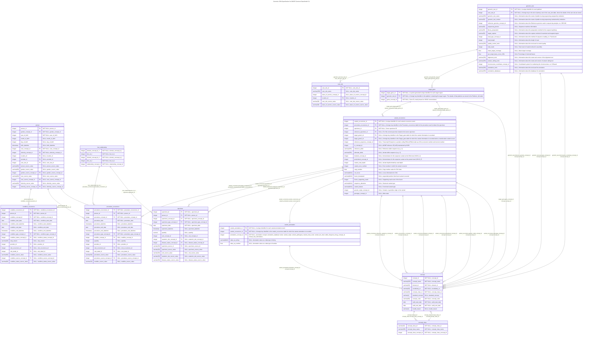

```mermaid
---
title: Genomic-CDM Specification for OMOP Common Data Model 5.4
---
%%{init: {
 "theme": "default",
 "themeCSS": [
  ".er.relationshipLabel { fill: black; }", 
  ".er.relationshipLabelBox { fill: white; }", 
  ".er.entityBox { fill: lightgray; }",
  "[id^=entity-genomic_test] .er.entityBox { fill: lightgreen; }",
  "[id^=entity-target_gene] .er.entityBox { fill: powderblue; }",
  "[id^=entity-variant_occurrence] .er.entityBox { fill: pink; }",
  "[id^=entity-variant_annotation] .er.entityBox { fill: pink; }"
  ]
}}%%
erDiagram

%% note "person table, FROM OMOP CDM"
person {
  integer person_id PK "NOT NULL, person_id"
  integer gender_concept_id FK "NOT NULL, gender_concept_id"
  integer year_of_birth "NOT NULL, year_of_birth"
  integer month_of_birth "NULL, month_of_birth"
  integer day_of_birth "NULL, day_of_birth"
  timestamp birth_datetime "NULL, birth_datetime"
  integer race_concept_id FK "NOT NULL, race_concept_id"
  integer ethnicity_concept_id FK "NOT NULL, ethnicity_concept_id"
  integer location_id FK "NULL, location_id"
  integer provider_id FK "NULL, provider_id"
  integer care_site_id FK "NULL, care_site_id"
  varchar(50) person_source_value "NULL, person_source_value"
  varchar(50) gender_source_value "NULL, gender_source_value"
  integer gender_source_concept_id FK "NULL, gender_source_concept_id"
  varchar(50) race_source_value "NULL, race_source_value"
  integer race_source_concept_id FK "NULL, race_source_concept_id"
  varchar(50) ethnicity_source_value "NULL, ethnicity_source_value"
  integer ethnicity_source_concept_id FK "NULL, ethnicity_source_concept_id"
}

%% note "care_site table, FROM OMOP CDM"
care_site {
  integer care_site_id PK "NOT NULL, care_site_id"
  varchar(255) care_site_name "NULL, care_site_name"
  integer place_of_service_concept_id "NULL, place_of_service_concept_id"
  integer location_id FK "NULL, location_id"
  varchar(50) care_site_source_value "NULL, care_site_source_value"
  varchar(50) place_of_service_source_value "NULL, place_of_service_source_value"
}

%% note "fact_relationship table, FROM OMOP CDM"
fact_relationship {
  integer domain_concept_id_1 "NOT NULL, domain_concept_id_1"
  integer fact_id_1 "NOT NULL, fact_id_1"
  integer domain_concept_id_2 "NOT NULL, domain_concept_id_2"
  integer fact_id_2 "NOT NULL, fact_id_2"
  integer relationship_concept_id "NOT NULL, relationship_concept_id"
}

%% note "specimen table, FROM OMOP CDM"
specimen {
  integer specimen_id PK "NOT NULL, specimen_id"
  integer person_id FK "NOT NULL, person_id"
  integer specimen_concept_id FK "NOT NULL, specimen_concept_id"
  integer specimen_type_concept_id FK "NOT NULL, specimen_type_concept_id"
  date specimen_date "NOT NULL, specimen_date"
  timestamp specimen_datetime "NULL, specimen_datetime"
  numeric quantity "NULL, quantity"
  integer unit_concept_id FK "NULL, unit_concept_id"
  integer anatomic_site_concept_id FK "NULL, anatomic_site_concept_id"
  integer disease_status_concept_id FK "NULL, disease_status_concept_id"
  varchar(50) specimen_source_id FK "NULL, specimen_source_id"
  varchar(50) specimen_source_value "NULL, specimen_source_value"
  varchar(50) unit_source_value "NULL, unit_source_value"
  varchar(50) anatomic_site_source_value "NULL, anatomic_site_source_value"
  varchar(50) disease_status_source_value "NULL, disease_status_source_value"
}

%% note "concept table, FROM OMOP CDM"
concept {
  integer concept_id "NOT NULL, concept_id"
  varchar(255) concept_name "NOT NULL, concept_name"
  varchar(20) domain_id "NOT NULL, domain_id"
  varchar(20) vocabulary_id "NOT NULL, vocabulary_id"
  varchar(20) concept_class_id "NOT NULL, concept_class_id"
  varchar(1) standard_concept "NULL, standard_concept"
  varchar(50) concept_code "NOT NULL, concept_code"
  date valid_start_date "NOT NULL, valid_start_date"
  date valid_end_date "NOT NULL, valid_end_date"
  varchar(1) invalid_reason "NULL, invalid_reason"
}

%% note "concept_class table, FROM OMOP CDM"
concept_class {
  varchar(20) concept_class_id "NOT NULL, concept_class_id"
  varchar(255) concept_class_name "NOT NULL, concept_class_name"
  integer concept_class_concept_id "NOT NULL, concept_class_concept_id"
}

%% note "procedure_occurrence table,FROM OMOP CDM"
procedure_occurrence {
  integer procedure_occurrence_id PK "NOT NULL, procedure_occurrence_id"
  integer person_id FK "NOT NULL, person_id"
  integer procedure_concept_id FK "NOT NULL, procedure_concept_id"
  date procedure_date "NOT NULL, procedure_date"
  timestamp procedure_datetime "NULL, procedure_datetime"
  date procedure_end_date "NULL, procedure_end_date"
  timestamp procedure_end_datetime "NULL, procedure_end_datetime"
  integer procedure_type_concept_id FK "NOT NULL, procedure_type_concept_id"
  integer modifier_concept_id FK "NULL, modifier_concept_id"
  integer quantity "NULL, quantity"
  integer provider_id FK "NULL, provider_id"
  integer visit_occurrence_id FK "NULL, visit_occurrence_id"
  integer visit_detail_id FK "NULL, visit_detail_id"
  varchar(50) procedure_source_value "NULL, procedure_source_value"
  integer procedure_source_concept_id FK "NULL, procedure_source_concept_id"
  varchar(50) modifier_source_value "NULL, modifier_source_value"
}

%% note "condition_occurrence table, FROM OMOP CDM"
condition_occurrence {
  integer condition_occurrence_id PK "NOT NULL, condition_occurrence_id"
  integer person_id FK "NOT NULL, person_id"
  integer condition_concept_id FK "NOT NULL, condition_concept_id"
  date condition_start_date "NOT NULL, condition_start_date"
  timestamp condition_start_datetime "NULL, condition_start_datetime"
  date condition_end_date "NULL, condition_end_date"
  timestamp condition_end_datetime "NULL, condition_end_datetime"
  integer condition_type_concept_id FK "NOT NULL, condition_type_concept_id"
  integer condition_status_concept_id FK "NULL, condition_status_concept_id"
  varchar(20) stop_reason "NULL, stop_reason"
  integer provider_id FK "NULL, provider_id"
  integer visit_occurrence_id FK "NULL, visit_occurrence_id"
  integer visit_detail_id FK "NULL, visit_detail_id"
  varchar(50) condition_source_value "NULL, condition_source_value"
  integer condition_source_concept_id FK "NULL, condition_source_concept_id"
  varchar(50) condition_status_source_value "NULL, condition_status_source_value"
}

%% note "genomic_test table, FROM OMOP G-CDM"
genomic_test{
  integer genomic_test_id PK "NOT NULL, A unique identifier for each platform"
  integer care_site_id  FK "NOT NULL, A foreign key to the site of primary care in the care_site table, where the details of the care site are stored"
  varchar(255) genomic_test_name "NULL, Information about the name of platform using sequencing assigned by institution"
  varchar(50) genomic_test_version "NULL, Information about the name of platform using sequencing maintained by institution"
  integer reference_genome_concept_id "NULL, Information about the Reference genome used to sequencing analysis, ex. GRCh38"
  varchar(50) sequencing_device "NULL, Sequencer machine information"
  varchar(50) library_preparation "NULL, Information about the preparation method for the sequencing library"
  varchar(50) target_capture "NULL, Information about the capture method of examined and targeted region"
  integer read_type_concept_id "NULL, Information about the method of sequence reading, ex. Paired-end"
  integer read_length "NULL, Information about the length of read"
  varchar(255) quality_control_tools "NULL, Information about the tool used to control quality"
  integer total_reads "NULL, Total count of reads involved in assembly"
  float mean_target_coverage "NULL, Mean target coverage"
  float per_target_base_cover_100x "NULL Percentage of selected bases"
  varchar(255) alignment_tools "NULL, Information about the name and version of the alignment tool"
  varchar(255) variant_calling_tools "NULL, Information about the name and version of variant calling tool"
  integer chromosome_coordinate_concept_id "NULL, Coordinated system for numbering the chromosomes, ex. O-Based"
  varchar(255) annotation_tools "NULL, Information about the tool used for annotation"
  varchar(255) annotation_databases "NULL, Information about the database for annotation"
}

%% note "target_gene table, FROM OMOP G-CDM"
target_gene{
  integer target_gene_id PK "NOT NULL, A system-generated unique identifier for each target region"
  integer genomic_test_id FK "NOT NULL, A foreign key identifier to the platform containing the target region. The details of that platform are stored in the Platform_info table"
  integer gene_concept_id "NOT NULL, Gene ID, mainly based on HGNC nomenclature"
  %%varchar(50) hgnc_symbol	"NOT NULL, Gene Symbol given by HGNC nomenclature"
  %%varchar(50) chromosome_id "NOT NULL, Chromosome ID"
  %%integer start_position "NOT NULL, start position"
  %%integer end_position "NOT NULL, end position"
}

%% note "variant_occurrence table, FROM OMOP G-CDM"
variant_occurrence{
  integer variant_occurrence_id PK "NOT NULL, A unique identifier for each variant occurrence event"
  integer procedure_occurrence_id FK "NOT NULL, A foreign key identifier to the Procedure_occurrence table for the procedure used to obtain the specimen"
  integer specimen_id FK "NOT NULL, Tumor specimen ID"
  integer reference_specimen_id FK "NULL, ID of the normal specimen related to the tumor specimen"
  integer target_gene1_id FK "NULL, A foreign key identifier to the Target_gene table for which the variant information is recorded"
  integer target_gene2_id FK "NULL, A foreign key identifier to the Target_gene table for which the variant information is recorded when a translocation variant occurs"
  integer reference_sequence_concept_id "NULL, Transcript ID based on a protein-coding RNA (mRNA) made up of the accession number and version number"
  integer rs_concept_id "NULL, dbSNP reference ID (rsID) maintained by NCBI"
  varchar(255) reference_allele "NULL, Reference allele sequence (e.g., A)"
  varchar(255) alternate_allele "NULL, Variant allele sequence (e.g., C)"
  integer dnalevel_concept_id "NULL, Nomenclature for the sequence variant at the DNA level (HGVS_C)"
  integer proteinlevel_concept_id "NULL, Nomenclature for the sequence variant at the protein level (HGVS_P)"
  integer variant_read_depth "NULL, Variant depth divided by read depth"
  integer variant_exon_number "NULL, Exon number in which the variant occurred"
  float copy_number "NULL, Copy number value for CNV data"
  varchar(MAX) cnv_locus "NULL, Locus information for CNV"
  varchar(MAX) fusion_breakpoint "NULL, sequential position that fusion variant occurred"
  integer fusion_supporting_reads "NULL, Supporting read count of the fusion"
  varchar(MAX) sequence_alteration "NULL, Structural variant type"
  varchar(MAX) variant_feature "NULL, Functional variant type"
  integer genetic_origin_concept_id "NULL, Somatic or germline origin or the variant"
  integer genotype_concept_id "NULL, Allele state"
}

%% note "variant_annotation table, FROM OMOP G-CDM"
variant_annotation{
  integer variant_annotation_id PK "NOT NULL, A unique identifier for each variant annotation event"
  integer variant_occurrence_id FK "NOT NULL, A foreign key identifier to the variant_occurrence table for which the variant annotation is recorded"
  integer annotation_concept_id PK "NOT NULL, annotation concept: annotation_database name, variant_origin, variant_pathogeny, variant_class_level, variant_tier_level, allele_frequency, drug_concept_id, clinical_trial_information..."
  varchar(MAX) value_as_string "NULL, Annotation value as a data type of string"
  float value_as_number "NULL, Annotation value as a data type of number"
  %% varchar(MAX) annotation_database "NOT NULL, Categories or database name of annotation"
  %% varchar(MAX) variant_origin "NULL, Annotation value as a data type of string"
  %% varchar(MAX) variant_pathogeny "NULL, Annotation value as a data type of number"
  %% varchar(MAX) variant_class_level "NULL, Annotation value as a data type of number"
  %% varchar(MAX) variant_tier_level "NULL, Annotation value as a data type of number"
  %% float allele_frequency "NULL, Annotation value as a data type of number"
  %% varchar(MAX) medication "NULL, Annotation value as a data type of number"
  %% varchar(MAX) clinical_trial_information "NULL, Annotation value as a data type of number"
}


person ||--o{ condition_occurrence : "person.person_id condition_occurrence.person_id" 
person ||--o{ procedure_occurrence : "person.person_id procedure_occurrence.person_id" 
person ||--o{ specimen : "person.person_id specimen.person_id" 
genomic_test ||--o{ care_site : "genomic_test.care_site_id care_site.care_site_id" 
variant_occurrence ||--o{ procedure_occurrence : "variant_occurrence.procedure_occurrence_id procedure_occurrence.procedure_occurrence_id" 
variant_occurrence ||--o{ specimen : "variant_occurrence.specimen_id specimen.specimen_id" 
variant_occurrence ||--o{ specimen : "variant_occurrence.reference_specimen_id specimen.specimen_id"
concept_class ||--o{ concept : "concept_class.concept_class_id concept.concept_class_id"
concept ||--o{ concept_class : "concept.concept_id concept_class.concept_class_concept_id"


fact_relationship ||--o{ procedure_occurrence : "fact_relationship.fact_id_1 procedure_occurrence.procedure_occurrence_id"
fact_relationship ||--o{ specimen : "fact_relationship.fact_id_2 specimen.specimen_id"

genomic_test ||--o{ target_gene : "genomic_test.genomic_test_id target_gene.genomic_test_id"
target_gene ||--o{ variant_occurrence : "target_gene.target_gene_id variant_occurrence.target_gene1_id"
target_gene ||--o{ variant_occurrence : "target_gene.target_gene_id variant_occurrence.target_gene2_id"
variant_occurrence ||--o{ variant_annotation : "variant_occurrence.variant_occurrence_id variant_annotation.variant_occurrence_id"


variant_annotation ||--o{ concept : "variant_annotation.annotation_concept_id concept.concept_id"
variant_occurrence ||--o{ concept : "variant_occurrence.reference_sequence_concept_id concept.concept_id"
variant_occurrence ||--o{ concept : "variant_occurrence.rs_concept_id concept.concept_id"
variant_occurrence ||--o{ concept : "variant_occurrence.dnalevel_concept_id concept.concept_id"
variant_occurrence ||--o{ concept : "variant_occurrence.proteinlevel_concept_id concept.concept_id"
variant_occurrence ||--o{ concept : "variant_occurrence.genetic_origin_concept_id concept.concept_id"
variant_occurrence ||--o{ concept : "variant_occurrence.genotype_concept_id concept.concept_id"
target_gene ||--o{ concept : "target_gene.gene_concept_id concept.concept_id"
genomic_test ||--o{ concept : "genomic_test.reference_genome_concept_id concept.concept_id"
genomic_test ||--o{ concept : "genomic_test.read_type_concept_id concept.concept_id"
genomic_test ||--o{ concept : "genomic_test.chromosome_coordinate_concept_id concept.concept_id"

```